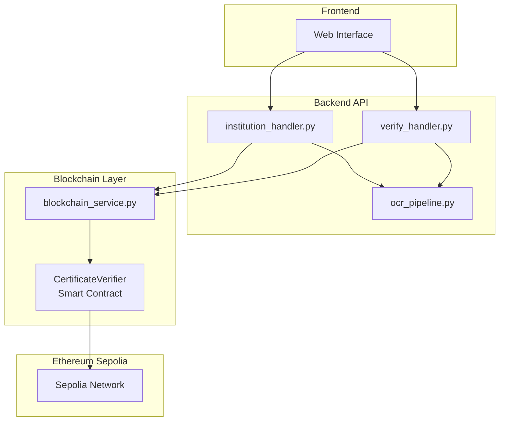
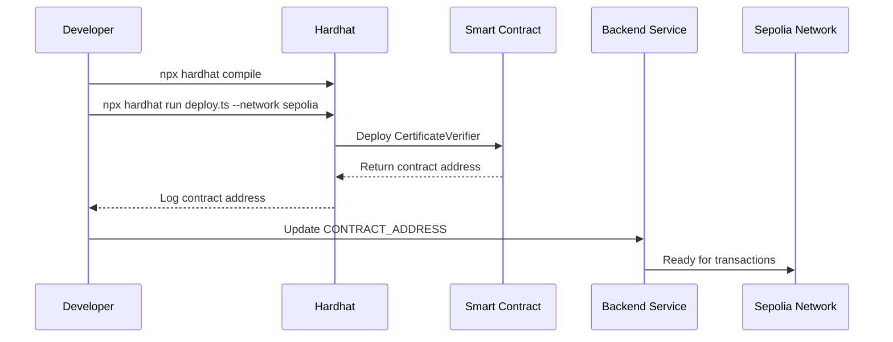
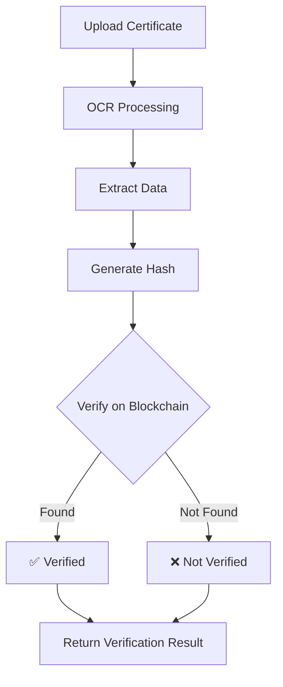

# Certificate Verification System with Blockchain Integration

A decentralized certificate verification system that uses Ethereum Sepolia testnet to register and verify academic certificates through OCR processing and smart contract integration.

## 🏗️ Architecture Overview



## 🚀 Quick Start

### Prerequisites
- Node.js 16+
- Python 3.8+
- Ethereum wallet with Sepolia testnet ETH

### Environment Setup

1. **Clone and install dependencies:**
```bash
# Backend
cd backend
pip install -r requirements.txt

# Smart Contracts
cd contracts
npm install
```

2. **Configure environment variables:**
Create `.env` file in project root:
```env
SEPOLIA_RPC_URL=https://sepolia.infura.io/v3/YOUR_PROJECT_ID
ISSUER_PRIVATE_KEY=0xYOUR_PRIVATE_KEY
```

3. **Deploy smart contract:**
```bash
cd contracts
npx hardhat run scripts/deploy.ts --network sepolia
```

4. **Update contract address:**
Copy the deployed contract address and update it in `backend/blockchain_service.py` [1](#0-0) .

## 📋 Core Components

### Smart Contract
- **Contract**: `CertificateVerifier.sol`
- **Network**: Ethereum Sepolia Testnet
- **Functions**: `registerHash(bytes32)`, `verifyHash(bytes32)`
- **Configuration**: Hardhat with Solidity 0.8.20 [2](#0-1) 

### Blockchain Service
The `blockchain_service.py` module provides Web3 integration for:
- **Hash Registration**: Writing certificate hashes via signed transactions
- **Hash Verification**: Reading hash existence from blockchain
- **Connection Management**: Web3 client initialization and account handling [3](#0-2) 

### OCR Pipeline
Certificate data extraction using Google Gemini API:
- Extracts student details, grades, and metadata
- Generates SHA-256 hashes for blockchain registration [4](#0-3) 

## 🔧 Deployment Flow



### Contract Deployment Steps

1. **Compile contract:**
```bash
npx hardhat compile
```

2. **Deploy to Sepolia:**
```bash
npx hardhat run scripts/deploy.ts --network sepolia
```

The deployment script will output the contract address [5](#0-4) .

3. **Verify contract (optional):**
```bash
npx hardhat verify --network sepolia DEPLOYED_CONTRACT_ADDRESS
```

## 🔄 Verification Workflow



## 📁 Project Structure

```
PixelNavigation/029/
├── backend/
│   ├── blockchain_service.py    # Web3 integration
│   ├── institution_handler.py   # Institution upload workflow
│   ├── verify_handler.py        # Public verification
│   └── ocr_pipeline.py          # Certificate processing
├── contracts/
│   ├── contracts/
│   │   └── CertificateVerifier.sol
│   ├── scripts/
│   │   └── deploy.ts
│   ├── hardhat.config.ts
│   └── artifacts/               # Compiled contract artifacts
└── uploads/
    ├── files/                   # Original uploads
    └── verified_originals/      # Verified certificates
```

## 🔑 Configuration Details

### Hardhat Network Configuration
The Sepolia network is configured with:
- **Chain ID**: 11155111
- **RPC URL**: From environment variable
- **Accounts**: Single private key from .env [6](#0-5) 

### Blockchain Service Configuration
- **Contract Address**: Hardcoded in service [1](#0-0) 
- **ABI Path**: Auto-loaded from artifacts [7](#0-6) 
- **Account Management**: Derived from private key [8](#0-7) 

## 🛠️ API Endpoints

### Institution Workflow
- **POST** `/institution/upload` - Upload certificates
- **POST** `/institution/confirm` - Process and register on blockchain

### Public Verification
- **POST** `/verify/upload` - Upload certificate for verification
- **GET** `/verify/status/{id}` - Check verification status

## ⚠️ Important Notes

- The system requires Sepolia testnet ETH for gas fees
- Contract address must be updated after each redeployment
- Private keys should never be committed to version control
- The system includes fallback mechanisms if blockchain is unavailable [9](#0-8) 

## 🧪 Testing

```bash
# Test contract deployment locally
npx hardhat test

# Test blockchain connection
python -c "from backend.blockchain_service import get_web3_verifier_instance; print(get_web3_verifier_instance())"
```

## 📝 License

This project is part of SIH 2025 (Smart India Hackathon 2025).

---

## Notes
- The README is based on the actual codebase structure and configuration files
- All diagrams reflect the real system architecture and deployment flows
- Configuration examples match the actual environment variables and setup requirements
- The blockchain service implements graceful degradation if the smart contract is unreachable

Wiki pages you might want to explore:
- [Blockchain Service (PixelNavigation/029)](/wiki/PixelNavigation/029#4.5)

### Citations

**File:** backend/blockchain_service.py (L1-3)
```python
# blockchain_service.py
# Handles all read and write interactions with the deployed CertificateVerifier contract.

```

**File:** backend/blockchain_service.py (L18-18)
```python
CONTRACT_ADDRESS = "0x762790707213673e44D920e7f4E00F167D03956a" 
```

**File:** backend/blockchain_service.py (L27-28)
```python
ABI_DIR = Path(__file__).parent.parent / "contracts" / "artifacts" / "contracts" / "CertificateVerifier.sol"
ABI_FILE_PATH = ABI_DIR / "CertificateVerifier.json"
```

**File:** backend/blockchain_service.py (L47-47)
```python
ISSUER_ACCOUNT = Account.from_key(ISSUER_PRIVATE_KEY)
```

**File:** contracts/hardhat.config.ts (L20-20)
```typescript
    solidity: "0.8.20", 
```

**File:** contracts/hardhat.config.ts (L27-33)
```typescript
        sepolia: { 
            // Type assertion (as string) is safe because we checked existence above
            url: SEPOLIA_RPC_URL as string, 
            chainId: 11155111, // Sepolia's Chain ID
            // Private key MUST be provided in an array format
            accounts: [ISSUER_PRIVATE_KEY as string],
        },
```

**File:** backend/ocr_pipeline.py (L160-198)
```python
def create_certificate_hash(certificate_data):
    """
    Generates a unique SHA-256 hash from the core certificate data fields.
    
    Args:
        certificate_data (dict): Normalized certificate data.
        
    Returns:
        str: The hex representation of the SHA-256 hash.
    """
    core_fields = [
        'student_name', 
        'student_id', 
        'university_name', 
        'degree_type', 
        'cgpa', 
        'year_of_passing', 
        'certificate_number'
    ]
    
    canonical_data = ""
    for field in core_fields:
        value = str(certificate_data.get(field, '')).strip().lower()
        canonical_data += value
        
    subject_grades = certificate_data.get('subject_grades', [])
    if isinstance(subject_grades, list) and subject_grades:
        # Create a list of 'subject:grade' strings, sort them, and join
        grade_strings = [
            f"{sg.get('subject_name', '').strip().lower()}:{sg.get('grade', '').strip().lower()}"
            for sg in subject_grades
        ]
        grade_strings.sort()
        canonical_data += "".join(grade_strings)

    encoded_data = canonical_data.encode('utf-8')
    sha256_hash = hashlib.sha256(encoded_data).hexdigest()
    
    return "0x" + sha256_hash
```

**File:** contracts/scripts/deploy.ts (L27-28)
```typescript
  console.log(`Contract deployed successfully!`);
  console.log(`Contract Address (The Address You Need): ${contractAddress}`);
```

**File:** backend/institution_handler.py (L202-217)
```python
try:
    # Import the blockchain service from the same backend directory
    from blockchain_service import register_hashes_on_blockchain
except ImportError as e:
    # Fallback for development/testing if the blockchain service is not set up
    print(
        f"WARNING: Could not import blockchain_service (register_hashes_on_blockchain): {e}. "
        "Hashes will be SKIPPED."
    )

    def register_hashes_on_blockchain(hashes):
        """Fallback: mark all hashes as SKIPPED instead of raising."""
        return [
            {"hash": hash_val, "status": "SKIPPED", "tx_hash": "N/A"}
            for hash_val in hashes
        ]
```
